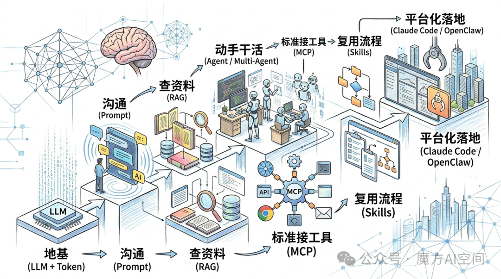

# LLM基本概念及链路
## 链路图

```text
地基（LLM + Token）
    ↓
沟通（Prompt）
    ↓
查资料（RAG）
    ↓
动手干活（Agent / Multi-Agent）
    ↓
标准接工具（MCP）
    ↓
复用流程（Skills）
    ↓
平台化落地（Claude Code / OpenClaw）
```
*概要：*

- 很多“AI应用进化路线”，其实都是在给 LLM 补齐三类短板：
* 缺知识（不知道最新事实）、
* 缺行动能力（不能操作外部系统）、
* 缺工程化复用（不能长期稳定跑、不能沉淀流程）。
- 所以解决办法：
* RAG 把“外部知识库”接进来，让回答更可追溯、更能更新。
* Agent 通过“工具调用 + 循环执行”，把聊天变成“能把事做完”的系统。
* MCP把“外部工具/数据”接入方式标准化，降低碎片化集成成本。
* Skills把“做事的方法”沉淀为可复用模块，避免每次都从零提示、从零试错。
* Claude Code / OpenClaw则是两种典型“落地形态”：一个把 Agent 放进开发者终端/IDE 工作流，一个把 Agent 做成“多聊天渠道网关+ 长生命周期运行”。
  
## 